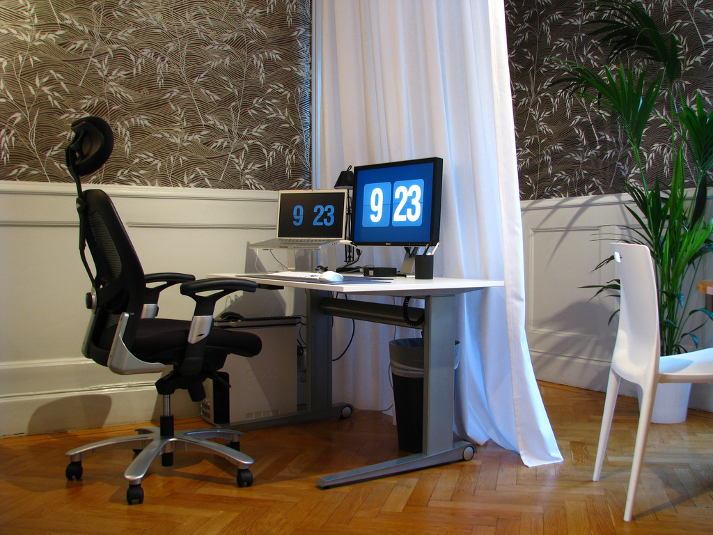
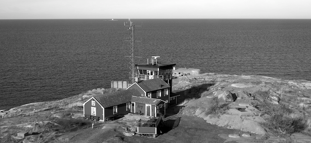

# {{ page.title }}

Vi söker dig som har stor entusiasm för systemutveckling och finner glädje i att ställas
inför olika utmaningar och att leverera nytta till våra kunder. Våra kunder finns inom
många olika branscher och uppgifterna kan variera, men kunderna förväntar sig alltid
bästa resultat med konsulter från Athega.

## Enkelt
Vi är ett effektivt företag där din åsikt är viktig och beslutsvägarna är korta. Hos
oss har du möjlighet att ta del av en mycket förmånlig lönemodell. Athega har flexibla
arbetstider, men hos kunder rättar vi oss efter deras arbetstider. Våra kunder förväntar
sig att vi är sociala, flexibla och att vi snabbt anpassar oss till deras olika arbetsplatser
och system.

## Utveckling
Vi lägger stort värde i personlig utveckling och ger dig möjlighet att växa i din roll,
stärka din kompetens och hänga med i den ständiga teknikutvecklingen genom att delta i
utbildningar, seminarier och konferenser, både externa och interna.

## Ha kul
Vi gillar att ha kul och vi träffas ofta för att skapa en “vi”-känsla och en möjlighet
att dra nytta av varandras erfarenhet och kompetens. Detta gör vi minst varje månad.
Vi träffas även regelbundet för gemensamma aktiviteter för att umgås och ha kul.

## Tänk nytt
Då uppdragen är av olika karaktär är det bra om du har en bred kunskap inom systemutveckling,
är intresserad och hungrig på nya tekniker och väljer dessa efter vilket problem eller
vilken uppgift du skall lösa.

Låter detta intressant? Känner du igen dig i beskrivningen? Skicka ett mail till
[rekrytering@athega.se](mailto:rekrytering@athega.se) så bokar vi en fika och berättar mer!

---

## Kort om Athega



Här hittar du information om våra uppdrag, våra kunder och hur det fungerar på Athega.
Om nedan punkter stämmer in på dig, finns det en stor chans att också du passar in på Athega

- trivs med att arbeta som konsult
- brinner för systemutveckling
- arbetar med back-end, mobilutveckling eller front-end
- tycker det sociala på arbetsplatsen är viktigt
- gillar att arbeta i teknikens framkant
- vill ständigt utvecklas både tekniskt och personligt
- har arbetat med utveckling större delen av ditt vuxna liv

### Aktiviteter

#### Sommarkonferens

Sommarkonferensen brukar vi tillbringa på Engsholms slott. Bilden är från ett år då vi labbade
med AR-drones. Mycket programmering och spännande tävlingsmoment.
 

Vi höll som vanligt till i strandateljén.

#### Höstkonferens

Höstkonferensen kallas Athega Codebase. Vi brukar bege oss ut i ytterskärgården till
Söderarm där vi huserar, leker med den senaste tekniken och har en väldigt trevlig helg.

[Rapport från Athega Codebase 2013](/blogg/2013/11/22/acb2013)

#### Övriga konferenser
Vi är även självklart med på det konferenser som berör oss i vårt arbete. Nordic JS, JFokus,
Leankanban med flera är vi frekventa besökare på. 

#### Internutbildningar
En gång i månaden har vi möte tillsammans då vi diskuterar arbetsrelaterade frågor.
Vi brukar även hålla internutbildningar där vi själva håller i presentationer och labbar.
Ämnena är väldigt spridda och alla välkomnas att hålla en session. Det kan handla om allt
från data-kluster och AI, digitalfotografering, Kanban-metoden, Java, Javascript, säkerhet
eller iOS-utveckling. Ofta fortsätter vi som kan umgås långt in på kvällen.

#### Övriga aktiviteter
De fredagar då det inte är internutbildning kan det hända att vi ändå träffas. Ibland
planerat med middag kanske i form av kräftskiva när det är säsong, andra gånger spontant.
